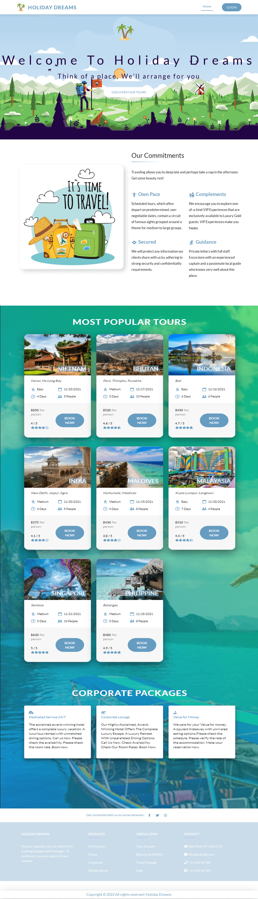

# Simple Site of 'Travel Related Service' (Holiday Dreams) - Assignment (Milestone - 11)
# This Repo is for 'Client Side'

* This Assignment is mainly on `Node` , `Express` , `MongoDB`, `React Router` along with `Firebase`.

* For Front-End (client side) - I have used - `React Bootstrap`, `Firebase Authentication`

* For Back-end - I have used - `Express.JS`, along with `Heroku App`

* For Database - I have used - `MongoDB`.

* Registered user can ADD Product to Service Page . Admin can Delete or Approve that order .

* `Custom 404 Error Page` added for concern.

* As a Basic `Private Route` Assignment , We had to Put many Routes .

* Basic `Banner` is added as well. 

* [Click Here for Live Link / Website - Client Side - (Firebase)](https://holiday-dreams.web.app/)

### Technology Used

* Node , Express
* Firebase , Heroku
* Google Firebase
* React JS
* React Router
* Google Crome Developer Tool
* React Bootstrap
* JavaScript (ES6)
* Fontawesome 6 Beta

* Screenshot of Live Site -

